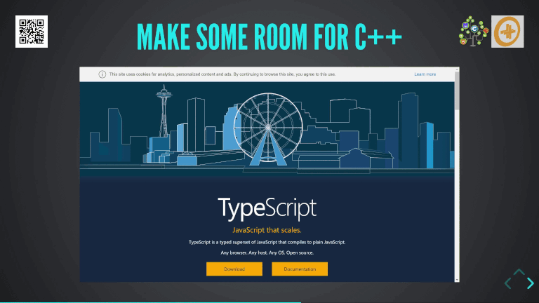

# `belle::vue` : C++ HTML5 Views
A WebAssembly Browser templating engine for your HTML5 C++ application.



## The C++ effort to the web
Here we list libraries part of the Bellevue effort :
- [nxxm](https://nxxm.github.io/) : html5 files compilation, dependency and easy-build with WebAssembly.
- [js::bind](https://github.com/nxxm/js-bind) : bind any C++ function to the Javascript Host API.
- [xxhr](https://nxxm.github.io/xxhr) : HTTP Requests cross-platform &amp; in the Browser
- [belle::vue](https://github.com/bellevue) : HTML5 Dom access, HTML5 view engines.
- [bete](https://github.com/nxxm/bete) : WebServer, Websocket Observables Data Types

## Features

* HTML5 and Browser API integration : `belle::vue::get_element_by_id`, `Element::innerHTML`...
* HTML5 datamodel views : 

```html
<ul>
  <li v-for="products"> {{name}} : {{quantity}} </li>
</ul>
```

## Getting started
Clone it directly and play with the [examples/](./examples) or use the library in your app : 

* `#include <belle/vue.hxx>` with [`.nxxm/deps`](https://nxxm.github.io) : 

```
{
  "nxxm/bellevue" : {}
}
```


## License
This project is licensed under the permissive MIT License, this is done to encourage you to contribute and make the next generation of Web Apps in WebAssembly together. 

[MIT License](./LICENSE.md), please just reproduce copyrights : 

```
Copyright (c) 2018 - present nxxm.io
```

